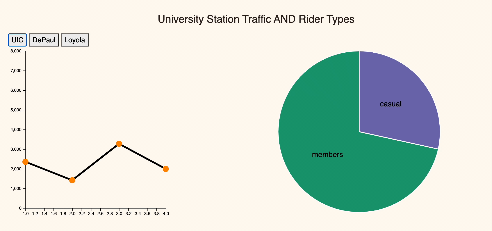
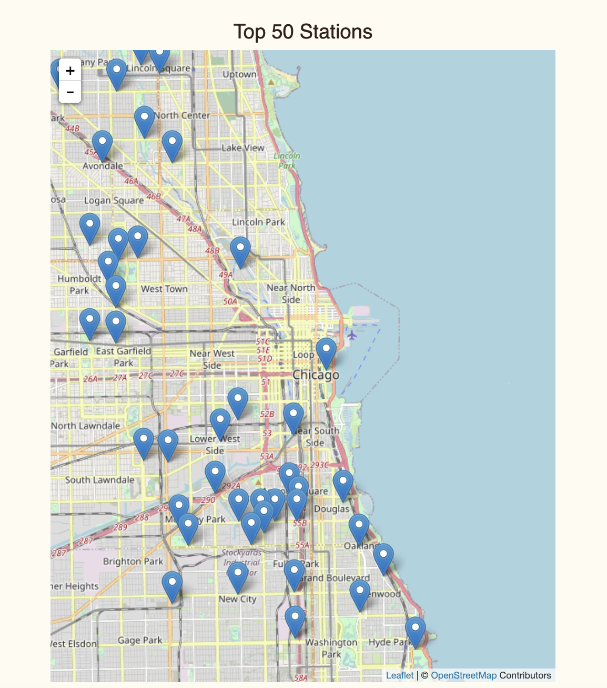

### Link: https://sjosep419.github.io/ 

#CS 424 Visualization and Visual Analytics
#Final Project:Divvy Bike

##Sylvia Joseph and Kartik Maheshwari
##Professor Miranda

#### Dataset Description:
The dataset for this project is the Divvy Bike dataset. The Divvy Bike Company is a bike-sharing company centered in Chicago. They provide CSVs of the data they collect from riders (start/end station, start/end time, member status, etc.) on their website.
 
https://ride.divvybikes.com/system-data 

#### Data Questions:
The main domain question for this project was “How did the pandemic affect the usage of Divvy Bikes in Chicago?” To answer this question, three data questions were derived:

* How did the pandemic affect station traffic at 3 of Chicago’s major universities? (also considering the type of riders)
* What kind of bikes were rented for more extended periods of time or distances in 2020?
* What areas of Chicago in 2020 have the most bikes picked up?

#### Data Transformation:
We mainly used data from 2020, with supplemental data from 2018. We started by removing all NaN and missing values from the data. We then filtered the data depending on the question that was being explored. For the first question, we filtered the data to only rows that had the start stations in one of the 3 major Chicago universities, 900 W. Harrison St for UIC, Sheridan Rd & Greenleaf Ave for Loyola, and Sheffield Ave & Fullerton Ave for DePaul (2020 & 2018). Then for the second exploration, we only used rows containing data for the type of bike used, the start/end station, and the start/end time. From there, we aggregated the start/end station and start/end time data together by calculating the distance between the start and end stations and the total time traveled between the start and end time, respectively (only for 2020). After filtering the data like this, we randomly removed rows from the data to avoid losing the true behavior of the data while still having the correct size for Observable. All of this data transformation was done using python and pandas due to the data being too large to have a smooth brush movement on our website. For our third visualization, we reused the dataset from our first question with an addition of including the vizualization for the rider membership type. At last we ran the mode command on the 2020 data and got the most visited station with coordinates to be plotted.

#### Encoding:
For the first visualization, we choose a line graph to aggregate ridership over a year for three university docking stations. In a way we utilized the tilt encode property of mark to synthesize the change in ridership over time (slope). Using a line plot was a good visualization decision because the viewer can see the drastic drop in ridership between quarters and the change in social situations (Covid-19). Then for the second one, for the brushable scatter plot we utilized the position on a common scale for the magnitude of ridership and the color for the identification of the types of bikes. Using the brushable scatter plot helped us explore each section of the plot (i.e. extremes). Then for the third new graph, we utilized the tilt encoding property of mark to synthesize the change in ridership over time (slope) for three universities and instigated a pie-char that takes in the area as a medium to encode. Then at last, the interactive map marks the station locations by utilizing horizontal and vertical positioning (longitude and latitude) form of encoding over a universal scale of openstreet map.

#### Explorations and Findings:

**Single Linked View:** As university students ourselves, we hypothesized that when online schooling began (start of the pandemic) that the ridership at stations at the aforementioned universities would decrease. Examining the interactive line graph indicates that this hypothesis is correct. In 2018, the number of riders increased as the spring semester went on, but in 2020 there was a decrease. This decrease was most likely due to students not being on campus because of online schooling.

**Multi-Linked View:** Going into this exploration, we made the hypothesis that electric bikes would be rented when needing to travel long distances because they would be easier to use while classic and docked bikes would be used for longer travel times because they would be more economical. Looking at the bar graph, this hypothesis does not seem correct because docked bikes were the more used bikes in 2020 regardless of distance or amount of time traveled. We believe this may be because of the higher availability of docked bikes at the stations.

**Multi-Linked View:** Since this exploration was an extension of the findings that we got from our first univerisity graph. So the only hypothesis that we made was regarding the types of riders, hence we though that there would me more casual riders during the covid era. Though our findings for each universities we got higher rates of divvy members. This was quite surprising but does makes sense because people living in the respective areas and working around the university area would rather take a bike to commute to work other than taking other public transportation. We predict that once covid is over and we Chicago gets its tourists back we would see more of casual riders and less of members.

**Spatial Graph:** Our spatial graph for this project was also an extension of our first project heat map. Based of the heatmap from first project we realize that the most popular stations would be in the loop area. Though after aggregating the top fifty stations using the leaflet interface we had the epiphany that most of the station are the in North and South of the loop and only one station that was inside the loop was the buckingham fountain station. Since we graphed the stations stations we believe that riders rode the bikes from outside the loop coming into the loop for the attractions that it has. To further prove this theory would could plot a spatial graph depicting the end stations.

